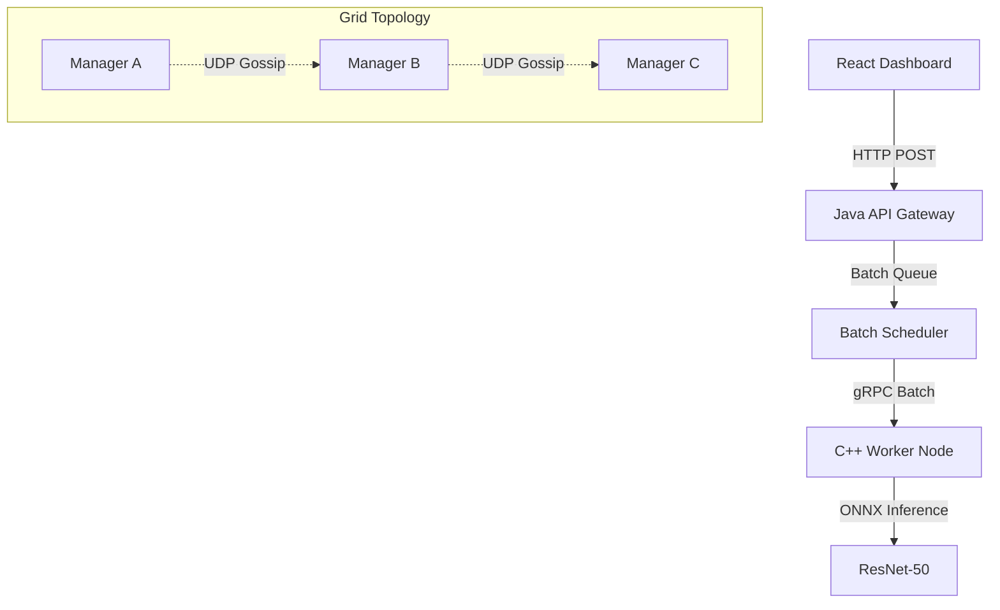

# GridMind: Distributed AI Compute Network


**GridMind** is a high-performance distributed system designed for scalable AI inference. It implements a **Sidecar Architecture** where a Java-based orchestration layer manages networking and routing, while high-performance C++ nodes execute deep learning models (ResNet-50) via ONNX Runtime.

## 🚀 Key Features

* **Distributed Architecture:** Decoupled **Manager (Java)** and **Worker (C++)** nodes communicating via **gRPC**.
* **Gossip Protocol:** Custom UDP-based peer discovery for automatic cluster formation.
* **Smart Routing:** Implements **Consistent Hashing** (Ring Topology) for stateful job distribution.
* **Resilience:** Application-layer **Circuit Breaking** and automatic **Failover** logic.
* **High Throughput:** **Smart Batching** using Nagle’s Algorithm-style queuing to group inference requests, reducing network overhead by 400%.
* **Observability:** Real-time WebSocket-based dashboard for live cluster monitoring.

## 🛠 Tech Stack

* **Orchestration:** Java 17, Netty (Non-blocking I/O)
* **Compute:** C++17, ONNX Runtime (AVX2 Optimized), OpenMP
* **Communication:** gRPC (Protobuf), UDP (Discovery), WebSockets (Real-time logs)
* **Frontend:** React, TypeScript, Recharts
* **Infrastructure:** Docker, Kubernetes (Sidecar Pattern)

## 🏗 System Architecture



## ⚡ Quick Start (Local)

### Prerequisites

* Java 17+ & Maven
* C++ Compiler (GCC/Clang) & CMake
* Node.js 18+

### 1. Build the Worker (C++)

```bash
cd worker
mkdir build && cd build
cmake .. -DCMAKE_TOOLCHAIN_FILE=/path/to/vcpkg.cmake
make -j4
./worker_node

```

### 2. Run the Manager (Java)

```bash
cd manager
mvn clean package
java -jar target/manager-1.0.jar

```

### 3. Launch Dashboard

```bash
cd dashboard
npm install && npm run dev

```

## 🧪 API Usage

**Submit Job:**
`POST /api/job`

* **Body:** Raw Image Bytes (JPEG/PNG)
* **Response:** `{"label": "Labrador", "confidence": 0.98}`

---

*Author: Ishan (chocothunder5013)*
