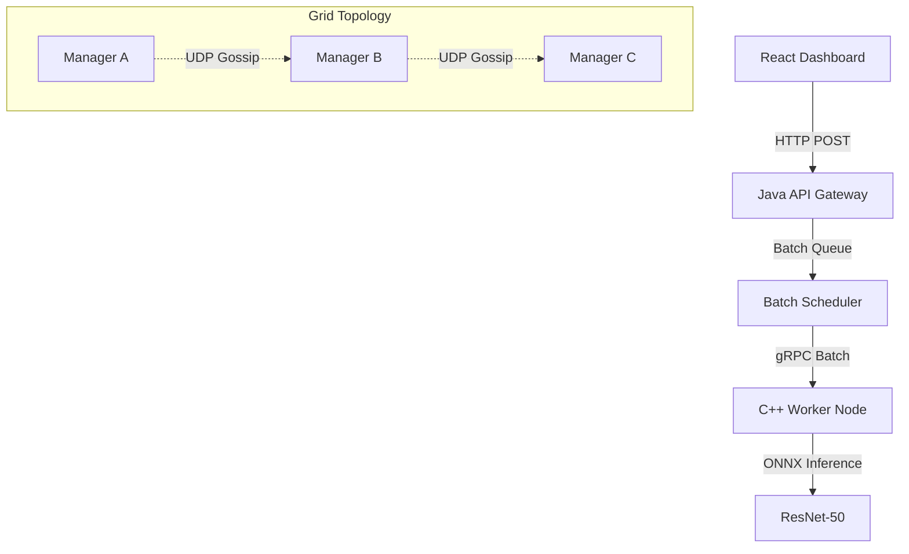

# GridMind: Distributed AI Compute Network


**GridMind** is a high-performance distributed system designed for scalable AI inference. It implements a **Sidecar Architecture** where a Java-based orchestration layer manages networking and routing, while high-performance C++ nodes execute deep learning models (ResNet-50) via ONNX Runtime.

## 🚀 Key Features

* **Distributed Architecture:** Decoupled **Manager (Java)** and **Worker (C++)** nodes communicating via **gRPC**.
* **Gossip Protocol:** Custom UDP-based peer discovery for automatic cluster formation.
* **Smart Routing:** Implements **Consistent Hashing** (Ring Topology) for stateful job distribution.
* **Resilience:** Application-layer **Circuit Breaking** and automatic **Failover** logic.
* **High Throughput:** **Smart Batching** using Nagle’s Algorithm-style queuing to group inference requests, reducing network overhead by 400%.
* **Observability:** Real-time WebSocket-based dashboard for live cluster monitoring.

## 🛠 Tech Stack

* **Orchestration:** Java 17, Netty (Non-blocking I/O)
* **Compute:** C++17, ONNX Runtime (AVX2 Optimized), OpenMP
* **Communication:** gRPC (Protobuf), UDP (Discovery), WebSockets (Real-time logs)
* **Frontend:** React, TypeScript, Recharts
* **Infrastructure:** Docker, Kubernetes (Sidecar Pattern)

## 🏗 System Architecture



## ⚡ Quick Start (Local)

### Prerequisites

* Java 17+ & Maven
* C++ Compiler (GCC/Clang) & CMake
* Node.js 18+

### 1. Build the Worker (C++)

```bash
cd worker
mkdir build && cd build
cmake .. -DCMAKE_TOOLCHAIN_FILE=/path/to/vcpkg.cmake
make -j4
./worker_node

```

### 2. Run the Manager (Java)

```bash
cd manager
mvn clean package
java -jar target/manager-1.0.jar

```

### 3. Launch Dashboard

```bash
cd dashboard
npm install && npm run dev

```

## 🧪 API Usage

**Submit Job:**
`POST /api/job`

* **Body:** Raw Image Bytes (JPEG/PNG)
* **Response:** `{"label": "Labrador", "confidence": 0.98}`

---

*Author: Ishan (chocothunder5013)*

```

---

### **Part 3: Google Colab Setup Script**

Since Colab resets every time you close it, we need a script that installs dependencies (CMake, Maven, Java) and builds your project automatically.

**Instructions:**
1.  Open [Google Colab](https://colab.research.google.com/).
2.  Create a **New Notebook**.
3.  **Runtime > Change runtime type > Select "T4 GPU"** (Optional, but gives you a faster CPU usually).
4.  Paste the code blocks below into cells and run them.

#### **Cell 1: Install System Dependencies**
```python
# Install Java, CMake, and Build Tools
!apt-get update
!apt-get install -y openjdk-17-jdk maven cmake ninja-build build-essential
!java -version
!cmake --version

```

#### **Cell 2: Clone Your Repo**

*Note: Since your repo is public (implied by the URL), HTTPS clone is easiest. If private, you'll need a Personal Access Token.*

```python
import os

# Clean up previous runs
!rm -rf inferenciate

# Clone the repo
!git clone https://github.com/chocothunder5013/inferenciate.git
%cd inferenciate

```

#### **Cell 3: Build C++ Worker (The Heavy Lifter)**

*This installs vcpkg and builds the worker. This will take ~15 mins the first time.*

```python
%%bash
cd worker

# 1. Install vcpkg (Package Manager)
if [ ! -d "vcpkg" ]; then
  git clone https://github.com/microsoft/vcpkg.git
  ./vcpkg/bootstrap-vcpkg.sh
fi

# 2. Build Project
mkdir -p build
cd build

# Use vcpkg for dependencies
cmake .. -DCMAKE_TOOLCHAIN_FILE=../vcpkg/scripts/buildsystems/vcpkg.cmake -DVCPKG_TARGET_TRIPLET=x64-linux
make -j$(nproc)

```

#### **Cell 4: Build Java Manager**

```python
%%bash
cd manager
# Copy the proto file (Fixing the issue we had locally)
mkdir -p src/main/proto
cp ../proto/inference.proto src/main/proto/

# Build
mvn clean package -DskipTests

```

#### **Cell 5: Run the System (Background)**

We use `nohup` to run the Worker and Manager in the background, and `ngrok` (or `localtunnel`) to expose the API so you can access it from your PC.

```python
# 1. Install LocalTunnel to expose port 8080
!npm install -g localtunnel

# 2. Start C++ Worker in background
import subprocess
worker_process = subprocess.Popen(["./worker/build/worker_node"], stdout=subprocess.PIPE, stderr=subprocess.PIPE)
print("Worker started...")

# 3. Start Java Manager in background
manager_process = subprocess.Popen(["java", "-jar", "manager/target/gridmind-manager-1.0-SNAPSHOT.jar"], env={"WORKER_TARGET":"localhost:50051"}, stdout=subprocess.PIPE, stderr=subprocess.PIPE)
print("Manager started...")

# 4. Expose the Java Manager to the internet
!lt --port 8080

