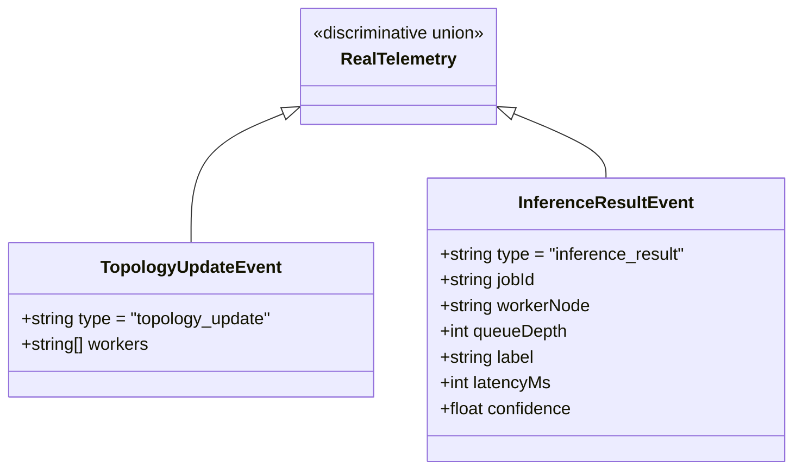

# API & Protocol Specifications

## Overview

Inferenciate provides three primary communication interfaces:
1. **HTTP REST API (Port 8080)**: Public client ingress for submitting single binary images (`/api/job`) or multipart batches (`/api/batch`).
2. **gRPC Protocol (Port 50051)**: Internal high-performance RPC interface between the Java Manager and C++ Worker nodes.
3. **WebSocket Telemetry Stream (Port 8080, `/ws`)**: Real-time event streaming interface for connected UI dashboards.

---

## 1. HTTP REST API Specification

### Base URL
`http://<MANAGER_HOST>:8080`

### Endpoints

#### 1. Single Image Inference
Submits a single raw binary encoded image payload for asynchronous batch scheduling and classification.

* **Method**: `POST`
* **Path**: `/api/job`
* **Headers**:
  * `Content-Type: application/octet-stream` (or standard image MIME type e.g. `image/jpeg`, `image/png`)
* **Request Body**: Raw binary image byte stream.
* **Success Response (200 OK)**:
  ```json
  {
    "label": "Class 263",
    "confidence": 94.82
  }
  ```
* **Error Responses**:
  * `400 Bad Request`: Empty or unreadable byte payload (`{"error": "Bad Request"}`).
  * `408 Request Timeout`: Inference exceeded 30-second execution SLA (`{"error": "Request Timed Out"}`).
  * `500 Internal Server Error`: Downstream worker exception (`{"error": "Inference Failed"}`).

---

#### 2. Multi-Image Batch Inference
Submits multiple image files within a single `multipart/form-data` request for immediate bulk inference.

* **Method**: `POST`
* **Path**: `/api/batch`
* **Headers**:
  * `Content-Type: multipart/form-data`
* **Request Body**: Form fields containing file uploads with unique form keys (e.g. `img_01`, `img_02`).
* **Success Response (200 OK)**:
  ```json
  [
    {
      "id": "img_01",
      "label": "Class 263",
      "confidence": 94.82
    },
    {
      "id": "img_02",
      "label": "Class 609",
      "confidence": 88.15
    }
  ]
  ```
* **Error Responses**:
  * `400 Bad Request`: Empty form body or zero uploaded files (`{"error": "Empty batch"}`).
  * `500 Internal Server Error`: Execution failed on worker node (`{"error": "Batch Failed"}`).

---

#### 3. Cross-Origin Resource Sharing (CORS) Preflight
* **Method**: `OPTIONS`
* **Path**: `/*`
* **Response (200 OK)**:
  * `Access-Control-Allow-Origin: *`
  * `Access-Control-Allow-Methods: GET, POST, OPTIONS`
  * `Access-Control-Allow-Headers: Content-Type`

---

## 2. gRPC Protocol Specification (`inference.proto`)

```protobuf
syntax = "proto3";
option java_multiple_files = true;

package inference;

service InferenceService {
  rpc Predict(InferenceRequest) returns (InferenceResponse) {}
  rpc PredictBatch(BatchInferenceRequest) returns (BatchInferenceResponse) {}
}

message InferenceRequest {
  string request_id = 1;
  bytes image_data = 2;
  int32 width = 3;
  int32 height = 4;
  int32 channels = 5;
}

message InferenceResponse {
  string request_id = 1;
  bool success = 2;
  string error_message = 3;
  string class_label = 4;
  float confidence_score = 5;
  int64 execution_time_ms = 6;
}

message BatchInferenceRequest {
  string batch_id = 1;
  repeated InferenceRequest requests = 2;
}

message BatchInferenceResponse {
  string batch_id = 1;
  repeated InferenceResponse responses = 2;
}
```

### Message Field Specifications

| Message | Field | Type | Tag | Description |
|---|---|---|---|---|
| `InferenceRequest` | `request_id` | `string` | 1 | Unique UUID string identifying the request across logs and traces. |
| | `image_data` | `bytes` | 2 | Raw binary image bytes (JPEG, PNG, or BMP) decoded by STB Image. |
| | `width` | `int32` | 3 | Optional spatial width metadata. |
| | `height` | `int32` | 4 | Optional spatial height metadata. |
| | `channels` | `int32` | 5 | Color channel count (default 3 for RGB). |
| `InferenceResponse` | `request_id` | `string` | 1 | UUID matching the corresponding `InferenceRequest`. |
| | `success` | `bool` | 2 | Boolean status flag indicating successful model execution. |
| | `error_message` | `string` | 3 | Stack trace or descriptive error if processing failed. |
| | `class_label` | `string` | 4 | Predicted ImageNet category label (e.g., "Class 263"). |
| | `confidence_score`| `float` | 5 | Softmax probability score normalized between `0.0` and `1.0`. |
| | `execution_time_ms`| `int64`| 6 | Per-item amortized runtime latency in milliseconds. |

---

## 3. WebSocket Telemetry Protocol

### Endpoint
`ws://<MANAGER_HOST>:8080/ws`

### Event Payloads



#### Event 1: `topology_update`
Emitted immediately upon client handshake completion and whenever the Kubernetes discovery service detects worker pod additions or removals.

```json
{
  "type": "topology_update",
  "workers": [
    "10.244.0.5",
    "10.244.0.6",
    "10.244.0.7"
  ]
}
```

#### Event 2: `inference_result`
Emitted asynchronously whenever an inference job finishes processing on a worker node.

```json
{
  "type": "inference_result",
  "jobId": "job-d4f18c62-8b9a-4c22-b912-706f9d3a1e2b",
  "workerNode": "10.244.0.5",
  "queueDepth": 1,
  "label": "Class 263",
  "latencyMs": 14,
  "confidence": 94.82
}
```
