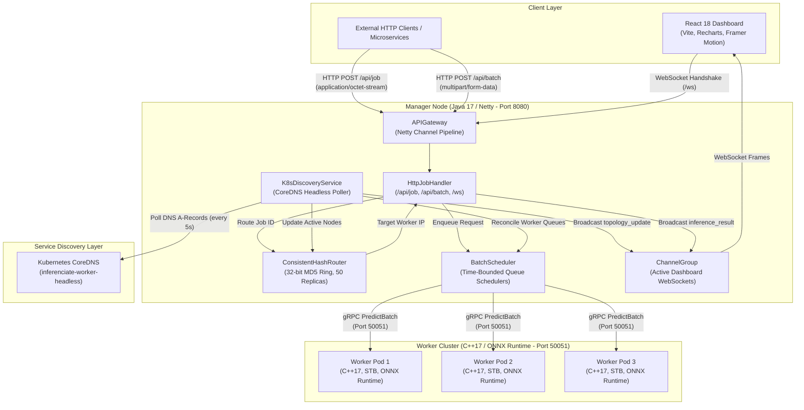
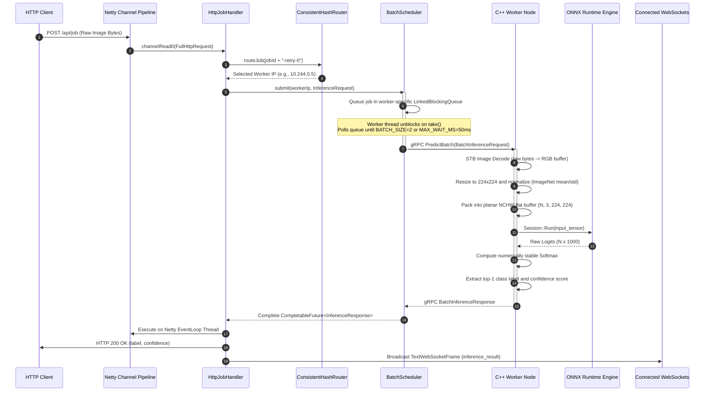

# Inferenciate System Architecture Specification

## Overview

Inferenciate is a distributed, heterogeneous machine learning inference platform designed for high-throughput, low-latency computer vision inference workloads. The system decouples network protocol handling and client connection management from intensive tensor computations by pairing a non-blocking Java (Netty) API Gateway with a cluster of native C++ (ONNX Runtime) worker nodes over gRPC.

---

## High-Level System Topology

---

## End-to-End Request Lifecycle

The sequence diagram below traces the end-to-end execution flow of a single image inference request submitted via the HTTP REST API.

---

## Core System Subsystems

### 1. Ingress and Protocol Decoding
* **`APIGateway.java`**: Configures Netty channel bootstrap with `NioServerSocketChannel`. Decodes HTTP payloads using `HttpServerCodec` and `HttpObjectAggregator(10MB)`. Upgrades WebSocket connections at endpoint `/ws`.
* **`HttpJobHandler.java`**: Implements asynchronous request routing. Ensures all response emissions and WebSocket writes occur on the Netty `EventLoop` thread (`ctx.executor().execute()`), preventing race conditions.

### 2. Consistent Hashing and Routing
* **`ConsistentHashRouter.java`**: Maintains a circular hash ring of 32-bit MD5 hashes using Java `TreeMap`.
* **Virtual Nodes**: Generates 50 virtual replicas per physical worker node to ensure uniform hash distribution and minimize ring partition variance.
* **Concurrency**: Uses `ReentrantReadWriteLock` to permit concurrent, lock-free lookups during job routing while enforcing exclusive write locks during worker addition and removal.

### 3. Dynamic Batch Scheduling
* **`BatchScheduler.java`**: Manages isolated per-worker queue pipelines (`ConcurrentHashMap<String, BlockingQueue<PendingJob>>`).
* **SLA Time Windowing**: A dedicated single-threaded dispatch loop drains items using `take()` (blocking until the first item arrives) followed by a bounded `poll()` loop (up to `BATCH_SIZE = 2` or `MAX_WAIT_MS = 50ms`).
* **Graceful Failure**: If a worker node disconnects or fails, `removeWorker()` drains all pending queue entries and completes their futures exceptionally.

### 4. Native Tensor Inference Engine
* **`worker/src/main.cpp`**: Compiled C++17 binary implementing `InferenceService::Service` over gRPC.
* **Contiguous Batch Memory Packing**: Converts variable-dimension decoded RGB image buffers into a flat planar `float` array layout `(N, 3, 224, 224)` in memory.
* **Hardware Acceleration**: Executes ONNX Runtime graph operations using 4 intra-op CPU execution threads.

### 5. Service Discovery and Telemetry Hub
* **`K8sDiscoveryService.java`**: Automatically resolves worker Pod IPs by polling the Kubernetes Headless Service domain (`inferenciate-worker-headless`) every 5 seconds.
* **Telemetry Streaming**: Real-time events (`inference_result`, `topology_update`) are pushed to all connected web dashboard clients via Netty `ChannelGroup`.

---

## Data Transformation Pipeline

The table below describes how request data is transformed as it flows through the layers of the architecture:

| Stage | Data Representation | Memory Layout / Structure | Responsible Component |
|---|---|---|---|
| **1. Client Upload** | Raw Image Binary | Encoded JPEG/PNG bytes (`application/octet-stream` or `multipart/form-data`) | Client Browser / HTTP Client |
| **2. Ingress Parsing** | Netty ByteBuf | Java heap / direct byte array | `HttpJobHandler.java` |
| **3. RPC Serialization** | Protocol Buffer Message | `inference.InferenceRequest` containing `ByteString` | Protobuf / gRPC Client Stub |
| **4. Queue Aggregation** | Batch Request Object | `inference.BatchInferenceRequest` holding $N$ requests | `BatchScheduler.java` |
| **5. C++ Decoding** | Interleaved RGB Pixels | 8-bit uncompressed interleaved byte array (`HWC`) | `stb_image.h` (`stbi_load_from_memory`) |
| **6. Tensor Preprocessing** | Normalized Planar Floats | 32-bit contiguous floating point array (`NCHW` format: $N \times 3 \times 224 \times 224$) | `worker/src/main.cpp` |
| **7. Inference Execution** | Output Logits | Unnormalized 32-bit floating point array ($N \times 1000$) | ONNX Runtime Session (`session.Run`) |
| **8. Probability Extraction** | Softmax Probabilities | Normalized float array $\sum p_i = 1.0$ | `softmax()` helper function |
| **9. RPC Response** | Protocol Buffer Response | `inference.BatchInferenceResponse` holding $N$ responses | gRPC Worker Service Stub |
| **10. Client Output** | JSON Response & WS Frame | Formatted JSON string (`label`, `confidence`, `latencyMs`, `queueDepth`) | `HttpJobHandler.java` |
