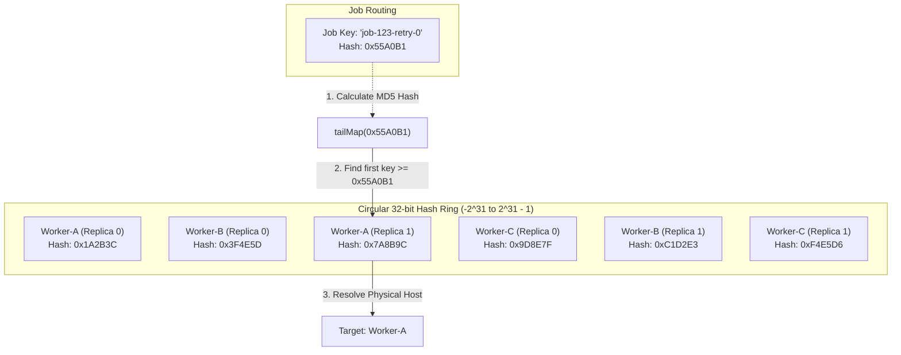
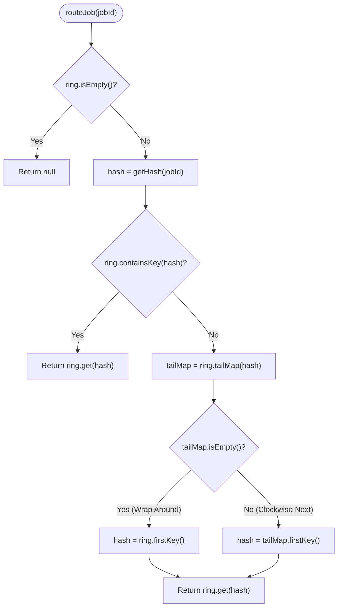

# Consistent Hashing & Cluster Routing Specification

## Overview

In distributed inference systems, routing incoming inference requests uniformly across an elastic pool of compute nodes is critical to prevent hotspotting and latency degradation. Standard modulus-based routing ($\text{hash}(k) \pmod N$) suffers from catastrophic key redistribution ($O(K)$ keys moved) whenever worker nodes scale up or down.

Inferenciate implements a **Virtual Node Consistent Hash Ring** in [`ConsistentHashRouter.java`](file:///home/ishangupta/inferenciate/manager/src/main/java/com/distsys/manager/ConsistentHashRouter.java) integrated into [`ClusterClient.java`](file:///home/ishangupta/inferenciate/manager/src/main/java/com/distsys/manager/ClusterClient.java), ensuring balanced load distribution, minimal partition movement ($O(K/N)$ keys re-mapped), and deterministic retry routing.

---

## Hash Ring Architecture



---

## Mathematical Specification & Hashing Mechanics

### 1. 32-Bit MD5 Integer Hash Function

The router generates a uniform 32-bit signed integer from string keys by extracting the first 4 bytes of an MD5 digest in little-endian order:

$$\text{hash}(k) = (D_3 \ll 24) \mid (D_2 \ll 16) \mid (D_1 \ll 8) \mid D_0$$

Where $D = \text{MD5}(\text{UTF-8}(k))$:

```java
private int getHash(String key) {
  try {
    MessageDigest md = MessageDigest.getInstance("MD5");
    byte[] digest = md.digest(key.getBytes());
    return ((digest[3] & 0xFF) << 24)
        | ((digest[2] & 0xFF) << 16)
        | ((digest[1] & 0xFF) << 8)
        | (digest[0] & 0xFF);
  } catch (NoSuchAlgorithmException e) {
    throw new RuntimeException("MD5 not supported", e);
  }
}
```

### 2. Virtual Node Replication Factor

For each physical worker node $W$, the router inserts $V = 50$ distinct virtual node replica keys onto the ring:

$$K_{w, i} = \text{hash}(W + \text{"-replica-"} + i) \quad \text{for } i \in [0, 49]$$

#### Why Virtual Nodes are Essential

With a small number of physical nodes (e.g., $N = 3$), placing single points on the circle creates large, non-uniform arc segments, leading to severe load imbalance (standard deviation $\sigma \approx 100\%$). By configuring $V = 50$ virtual nodes per worker, the ring contains $N \cdot V = 150$ total points, dramatically reducing partition variance:

$$\sigma_{\text{load}} \approx \frac{1}{\sqrt{V}} \approx \frac{1}{\sqrt{50}} \approx 14.1\%$$

---

## Ring Lookup and Wrap-Around

Job routing operates in $O(\log(N \cdot V))$ logarithmic time using Java's red-black tree implementation (`java.util.TreeMap`):



---

## Deterministic Retry Salt Routing

When an inference job encounters a transient worker failure or network timeout, the client may retry the request. Rather than sending the retry to the same failed worker, [`ClusterClient.java`](file:///home/ishangupta/inferenciate/manager/src/main/java/com/distsys/manager/ClusterClient.java) salts the routing key with the retry attempt counter:

$$\text{routingKey} = \text{jobId} + \text{"-retry-"} + \text{attempt}$$

* **Attempt 0**: `job-abc123-retry-0` maps to primary worker $W_1$.
* **Attempt 1**: `job-abc123-retry-1` maps to a distinct pseudo-random point on the hash ring, naturally landing on backup worker $W_2$ without maintaining explicit backup state tables.

---

## Concurrency Model (`ReentrantReadWriteLock`)

The hash ring utilizes `java.util.concurrent.locks.ReentrantReadWriteLock` to guarantee safety across multi-threaded operations:

| Operation | Lock Mode | Complexity | Thread Contention Impact |
|---|---|---|---|
| `routeJob(jobId)` | `readLock()` | $O(\log(N \cdot V))$ | **Zero Contention**: Multiple concurrent Netty event loop threads perform non-blocking lookups in parallel. |
| `addNode(address)` | `writeLock()` | $O(V \cdot \log(N \cdot V))$ | **Exclusive**: Blocks read lookups only for the brief duration of inserting 50 replica entries. |
| `removeNode(address)`| `writeLock()` | $O(V \cdot \log(N \cdot V))$ | **Exclusive**: Blocks read lookups only for the brief duration of removing 50 replica entries. |
