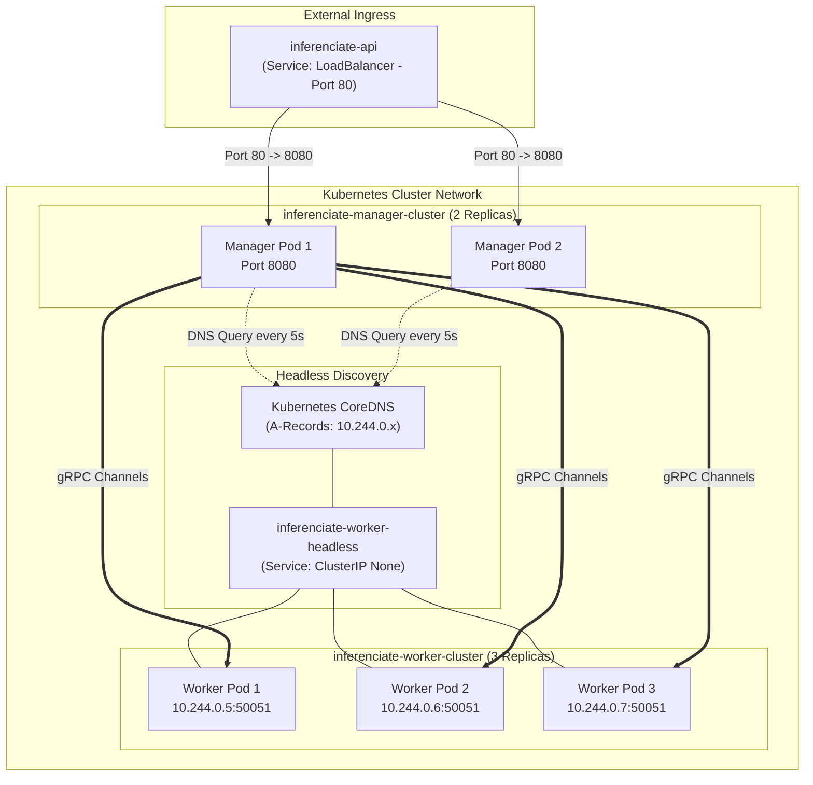
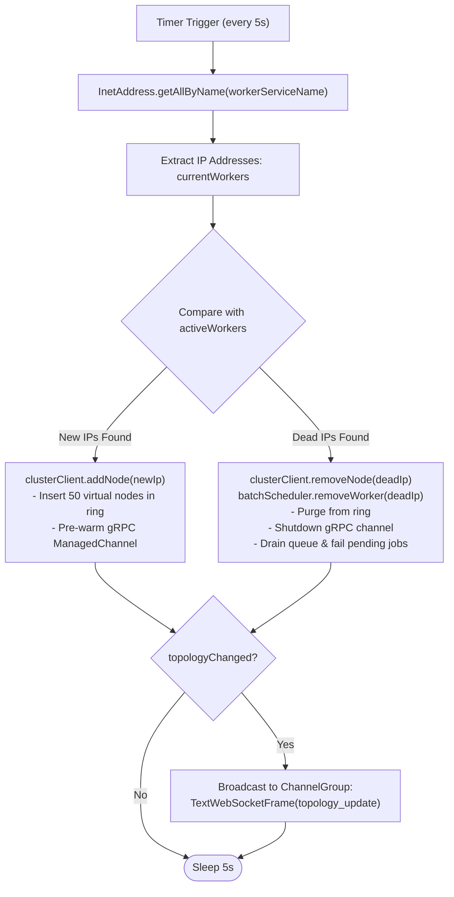

# Deployment & Operations Guide

## Overview

Inferenciate supports two primary deployment topologies:
1. **Local Development / Staging Environment**: Orchestrated via Docker Compose with dynamic worker scaling.
2. **Production Kubernetes Cluster**: Deployed with Headless Services for CoreDNS pod discovery, separate Manager and Worker Deployments, and external LoadBalancer Ingress.

---

## Kubernetes Production Architecture



---

## 1. Local Containerized Setup (Docker Compose)

The [`docker-compose.yml`](file:///home/ishangupta/inferenciate/docker-compose.yml) manifest creates an isolated bridge network (`grid-net`) interconnecting the Manager, Worker, and Dashboard containers.

### Launching the Stack

```bash
# Build and start all services in detached mode
docker-compose up --build -d
```

### Scaling Worker Compute Dynamically

To expand the C++ inference capacity, scale the `worker` service container pool:

```bash
docker-compose up -d --scale worker=3
```

### Service Endpoints

| Service | Protocol | Host Port | Container Port | Purpose |
|---|---|---|---|---|
| **Dashboard** | HTTP | `5173` | `5173` | React Web Telemetry UI |
| **Manager Node** | HTTP / WS | `8080` | `8080` | API Gateway & WebSocket Telemetry |
| **Worker Node** | gRPC | `50051` | `50051` | Native C++ Inference Server |

---

## 2. Production Kubernetes Deployment

The [`k8s-inferenciate.yaml`](file:///home/ishangupta/inferenciate/k8s-inferenciate.yaml) manifest bundles the complete production topology:

```bash
kubectl apply -f k8s-inferenciate.yaml
```

### Manifest Component Specifications

#### 1. Headless Worker Service (`inferenciate-worker-headless`)
* **`clusterIP: None`**: Configures a Headless Service. When queried, CoreDNS returns a list of individual Pod IP addresses rather than a single virtual cluster IP.
* **Port**: `50051/TCP`.

#### 2. Worker Deployment (`inferenciate-worker-cluster`)
* **Replicas**: 3 (configurable for HPA).
* **Resource Bounds**:
  * `requests`: `cpu: 1000m`, `memory: 1Gi`
  * `limits`: `cpu: 2000m`, `memory: 2Gi`
* **Port**: `50051/TCP`.

#### 3. Manager Deployment (`inferenciate-manager-cluster`)
* **Replicas**: 2 (for high availability).
* **Environment Variable**: `WORKER_SERVICE_NAME=inferenciate-worker-headless` (directs DNS queries to the headless service).
* **Port**: `8080/TCP`.

#### 4. Public LoadBalancer Service (`inferenciate-api`)
* **Type**: `LoadBalancer`.
* **Port Mapping**: Port `80` externally routes to Port `8080` on the Manager pods.

---

## Kubernetes DNS Auto-Discovery Engine

The discovery loop in [`K8sDiscoveryService.java`](file:///home/ishangupta/inferenciate/manager/src/main/java/com/distsys/manager/K8sDiscoveryService.java) runs on a 5-second recurring interval:



---

## Operational Troubleshooting & Diagnostics

### Checking Manager Logs
```bash
kubectl logs -l app=inferenciate-manager -f
```
Expected output:
```
[Discovery] New Worker Pod discovered: 10.244.0.5
[Cluster] Adding node to Hash Ring: 10.244.0.5
[Manager] API Gateway listening on port 8080
```

### Checking Worker Logs
```bash
kubectl logs -l app=inferenciate-worker -f
```
Expected output:
```
[Worker] ONNX Model loaded successfully!
[Worker] Server listening on [::]:50051
[Worker] Processing True Batch batch-1723630000 (Size: 2)
```

### Synthetic Load Testing via ChaosControl

The Dashboard UI includes an embedded load testing panel ([`ChaosControl.tsx`](file:///home/ishangupta/inferenciate/dashboard/src/components/ChaosControl.tsx)):
1. Navigate to `http://localhost:5173`.
2. Locate the **Chaos Test** panel in the right sidebar.
3. Adjust the **Target Load** slider (1 to 50 RPS).
4. Click **Initiate Load Spike** to generate synthetic HTTP traffic and verify dynamic batching and worker load distribution in real time.
