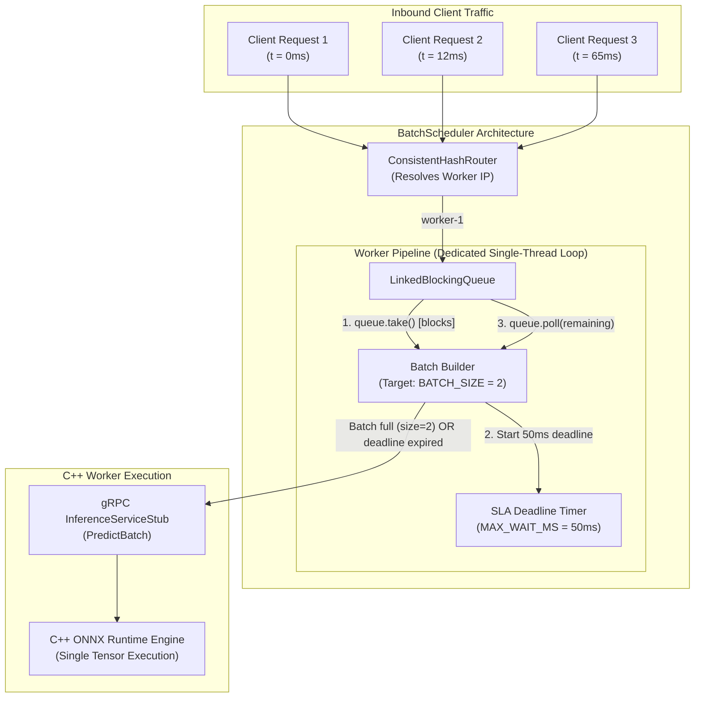
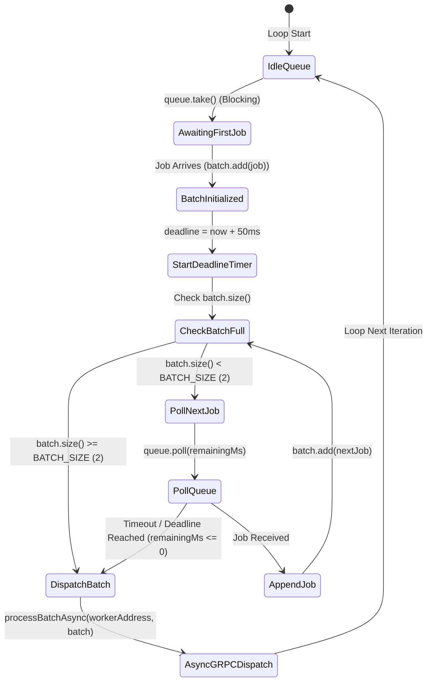

# Dynamic Batch Scheduling Specification

## Overview

In machine learning inference workloads, executing models on individual requests introduces significant per-request overhead from tensor memory allocation, framework kernel launches, and CPU/GPU memory bus transfers. **Dynamic Batching** aggregates independently arriving inference requests into multi-item tensors before execution, maximizing SIMD vectorization and hardware throughput while maintaining bounded latency SLAs.

In Inferenciate, dynamic batching is orchestrated in the Java Manager Node by [`BatchScheduler.java`](file:///home/ishangupta/inferenciate/manager/src/main/java/com/distsys/manager/BatchScheduler.java).

---

## Architectural Design



---

## The Dynamic Batch Draining Algorithm

The dispatch loop runs continuously on a dedicated, single-threaded `ExecutorService` per worker node:



### Algorithm Implementation Rationale

1. **Zero Busy-Waiting**: The loop blocks on `queue.take()` until at least one pending job arrives. This guarantees zero CPU utilization when the cluster is idle.
2. **Deterministic Latency Ceiling**: As soon as the first job is taken, a deadline timestamp is computed:
   $$\text{deadline} = \text{currentTimeMillis}() + \text{MAX\_WAIT\_MS}$$
3. **Bounded Polling**: Subsequent jobs are pulled via `queue.poll(remaining, TimeUnit.MILLISECONDS)`. If no additional job arrives before the remaining time expires, the loop immediately flushes the partial batch.
4. **Immediate Flushing on Capacity**: When `batch.size() == BATCH_SIZE`, the loop breaks immediately without waiting for the timeout, minimizing latency under heavy traffic.

---

## Configuration Parameters & Trade-offs

| Parameter | Current Value | Performance Impact | Latency Impact |
|---|---|---|---|
| `BATCH_SIZE` | `2` | Higher values increase SIMD parallelism and overall system job throughput (jobs/sec). | Higher values increase p99 latency under sparse traffic while waiting for batch accumulation. |
| `MAX_WAIT_MS` | `50ms` | Lower values prevent head-of-line blocking under bursty workloads. | Sets a strict ceiling on the maximum scheduling delay added to an individual inference request. |

### Timeline Scenario: Dynamic Batch Execution

```
Time (ms)  0        10       20       30       40       50       60       70
           |--------|--------|--------|--------|--------|--------|--------|
Scenario A:
Job 1      * (Arrives)
Job 2               * (Arrives -> Batch Size = 2 reached!)
Dispatch   ==========> (Immediate Dispatch at t=12ms, Latency delay = 12ms)

Scenario B:
Job 1      * (Arrives)
Job 2      [No second job arrives]
Dispatch   ============================================> (Dispatch at t=50ms, Deadline reached)
```

---

## Concurrency and Thread Safety

1. **Queue Isolation**: Each worker node has an isolated `LinkedBlockingQueue<PendingJob>` inside a `ConcurrentHashMap<String, BlockingQueue<PendingJob>>`.
2. **Single-Threaded Execution**: Each worker queue is consumed by a dedicated single-threaded executor (`Executors.newSingleThreadExecutor()`). This eliminates inter-thread lock contention during batch assembly.
3. **Non-Blocking gRPC Stub**: Dispatch is performed using asynchronous gRPC stubs (`InferenceServiceStub.predictBatch()`), ensuring the scheduler thread is never blocked by downstream network or compute latencies.
4. **Future Mapping**: Individual request completions are decoupled via Java `CompletableFuture<InferenceResponse>`. When the worker returns a `BatchInferenceResponse`, each response is matched to its corresponding job future by `request_id`.

---

## Failure Recovery & Worker De-registration

When a worker node fails a health check or scales down, [`BatchScheduler.removeWorker(String workerAddress)`](file:///home/ishangupta/inferenciate/manager/src/main/java/com/distsys/manager/BatchScheduler.java) executes:

1. **Thread Shutdown**: Removes and immediately terminates the worker's executor thread via `executor.shutdownNow()`.
2. **Queue Draining**: Atomically removes and drains all un-dispatched `PendingJob` items from the worker's queue.
3. **Exceptional Future Completion**: Completes every abandoned job's `CompletableFuture` with a `RuntimeException("Worker died before processing batch.")`, enabling the upstream HTTP layer to fail fast and trigger client retries.
