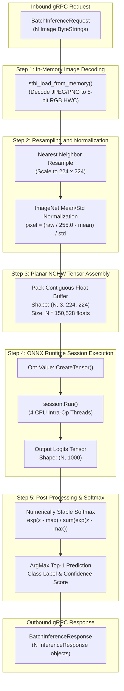

# Native Inference Worker Engine Specification

## Overview

The Inferenciate Worker Node is a native C++17 process compiled with the ONNX Runtime C++ API and gRPC. It is responsible for decoding incoming image byte streams, performing spatial resampling and normalization, assembling multi-image contiguous planar NCHW tensors, and executing batched neural network inference against the ResNet-50 v2 ONNX model.

The engine source is located at [`worker/src/main.cpp`](file:///home/ishangupta/inferenciate/worker/src/main.cpp).

---

## Native Execution Pipeline



---

## Preprocessing & Tensor Layout Transformation

### 1. In-Memory Image Decoding

Raw image byte streams (JPEG, PNG, BMP) are decoded directly from memory buffers without disk I/O using the single-header STB Image decoder:

```cpp
int width, height, img_channels;
unsigned char* img_data = stbi_load_from_memory(
    reinterpret_cast<const unsigned char*>(raw_data.c_str()),
    raw_data.size(), &width, &height, &img_channels, 3);
```

### 2. Spatial Resampling & ImageNet Normalization

Images are resampled to the $224 \times 224$ input dimensions required by ResNet-50 v2 using nearest-neighbor coordinate mapping:

$$\text{scale}_x = \frac{\text{width}}{224}, \quad \text{scale}_y = \frac{\text{height}}{224}$$
$$\text{src}_x = \lfloor x \cdot \text{scale}_x \rfloor, \quad \text{src}_y = \lfloor y \cdot \text{scale}_y \rfloor$$

Pixel intensity values ($[0, 255]$) are converted to floating point ($[0.0, 1.0]$) and normalized per channel using ImageNet standard coefficients:

$$\text{normalized}[c] = \frac{\frac{\text{pixel}[c]}{255.0} - \mu[c]}{\sigma[c]}$$

Where:
* $\mu = [0.485, 0.456, 0.406]$ (RGB channel means)
* $\sigma = [0.229, 0.224, 0.225]$ (RGB channel standard deviations)

### 3. Interleaved HWC to Planar NCHW Transformation

Standard image decoders produce interleaved HWC pixel buffers (`RGBRGBRGB...`). Modern deep learning frameworks require planar NCHW buffers (all Red pixels, then all Green pixels, then all Blue pixels per batch item).

```
Interleaved HWC Buffer (Decoded Image):
[R0, G0, B0, R1, G1, B1, R2, G2, B2, ..., R50175, G50175, B50175]

Planar NCHW Memory Layout (Batched ONNX Input):
|--- Batch Item 0 (150,528 floats) ---|--- Batch Item 1 (150,528 floats) ---|
| RRR... (50,176) | GGG... (50,176) | BBB... (50,176) | RRR... | GGG... | BBB... |
```

The memory index formula for planar packing is:

$$\text{offset} = (b \cdot C \cdot H \cdot W) + (c \cdot H \cdot W) + (y \cdot W) + x$$

Where $b \in [0, N-1]$, $C = 3$, $H = 224$, $W = 224$.

```cpp
int64_t batch_offset = b * single_img_size;
for (int y = 0; y < input_height; ++y) {
  for (int x = 0; x < input_width; ++x) {
    int src_x = (int)(x * scale_x);
    int src_y = (int)(y * scale_y);
    int src_idx = (src_y * width + src_x) * 3;

    for (int c = 0; c < 3; ++c) {
      float pixel = img_data[src_idx + c] / 255.0f;
      batched_tensor_values[batch_offset +
                            c * input_height * input_width +
                            y * input_width + x] =
          (pixel - mean[c]) / std[c];
    }
  }
}
stbi_image_free(img_data);
```

---

## ONNX Runtime Session Execution

The ONNX Runtime session is initialized once at worker startup with intra-operator multithreading enabled:

```cpp
Ort::Env env(ORT_LOGGING_LEVEL_WARNING, "WorkerNode");
Ort::SessionOptions session_options;
session_options.SetIntraOpNumThreads(4);
session = Ort::Session(env, "/models/resnet50-v2-7.onnx", session_options);
```

### Batch Tensor Execution

1. **CPU Tensor Allocation**: Wraps the contiguous flat float buffer into an `Ort::Value` tensor without extra memory copies:
   ```cpp
   std::vector<int64_t> input_node_dims = {batch_size, 3, 224, 224};
   auto memory_info = Ort::MemoryInfo::CreateCpu(OrtArenaAllocator, OrtMemTypeDefault);
   Ort::Value input_tensor = Ort::Value::CreateTensor<float>(
       memory_info, batched_tensor_values.data(), batched_tensor_values.size(),
       input_node_dims.data(), input_node_dims.size());
   ```

2. **Session Run**: Executes model graph execution:
   ```cpp
   auto output_tensors = session.Run(
       Ort::RunOptions{nullptr}, input_names, &input_tensor, 1, output_names, 1);
   ```

---

## Numerically Stable Softmax

The raw output tensor contains unnormalized logits $z \in \mathbb{R}^{1000}$ for each batch element. Direct exponentiation $e^{z_i}$ is susceptible to floating-point overflow for large positive logits ($z_i > 88.7$ for 32-bit floats).

Inferenciate applies the maximum subtraction identity:

$$p_i = \frac{e^{z_i - \max_k(z_k)}}{\sum_{j=1}^{1000} e^{z_j - \max_k(z_k)}}$$

```cpp
void softmax(std::vector<float>& input) {
  float max_val = *std::max_element(input.begin(), input.end());
  float sum = 0;
  for (float& val : input) {
    val = std::exp(val - max_val);
    sum += val;
  }
  for (float& val : input) val /= sum;
}
```

Top-1 predictions and confidence percentages are extracted using `std::max_element` and populated into the `InferenceResponse` protobuf payload.

---

## gRPC Server Configuration

* **Listening Port**: `0.0.0.0:50051`
* **Transport Credentials**: Insecure Server Credentials (internal cluster mesh)
* **Maximum Message Size**: Configured to 50MB via `builder.SetMaxReceiveMessageSize(50 * 1024 * 1024)` to support concurrent multi-megabyte batch payloads.
